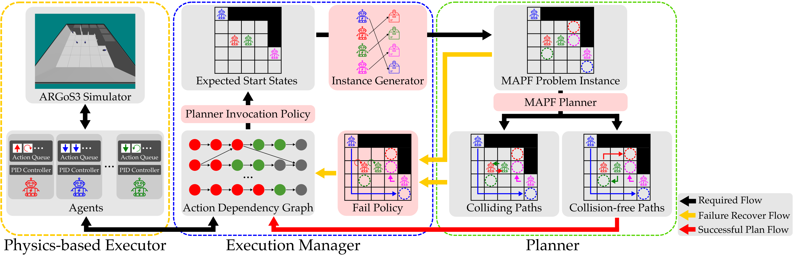

<div class="lsmart-home-content">

# Lifelong Scalable Multi-Agent Realistic Testbed (LSMART)

<p align="center">
  
</p>

## Introduction

Lifelong Scalable Multi-Agent Realistic Testbed (LSMART) is an open-source simulator to evaluate any Multi-Agent Path Finding (MAPF) algorithm in a Fleet Management System (FMS) with Automated Guided Vehicles (AGVs) under lifelong MAPF (LMAPF) settings. MAPF aims to move a group of agents from their corresponding starting locations to their goals. Lifelong MAPF (LMAPF) is a variant of MAPF that continuously assigns new goals for agents to reach. LMAPF applications, such as autonomous warehouses, often require a centralized, lifelong system to coordinate the movement of a fleet of robots, typically AGVs. However, existing works on MAPF and LMAPF often assume simplified kinodynamic models, such as pebble motion, as well as perfect execution and communication for AGVs. LSMART encapsulates key design choices of a real-world FMS in separate modules. These include:

1. **an invocation policy**: given the current states of the robots, it determines if the planner should be invoked.
2. **a MAPF problem instance generator**: given the current states of the robots, it returns the a MAPF problem instance.
3. **a MAPF planner**: given a MAPF problem instance with start and goal locations, it returns collision-free paths.
4. **a fail policy**: if the MAPF planner fails to return collision-free paths, it recovers the system from failure.

---

## Real-world Considerations

<div class="lsmart-video-row">

  <figure class="lsmart-video-figure-two">
    <video src="https://github.com/user-attachments/assets/b4504aac-a41e-4b98-bb36-c3fb9f0db369" autoplay muted loop width=480>
    </video>
    <p align="center"><em>Differentiable Drive Robot Kinodynamics</em></p>
  </figure>

  <figure class="lsmart-video-figure-two">
    <video src="https://github.com/user-attachments/assets/5865ca09-0718-41c6-8cb7-408b24ff86ad" autoplay muted loop width=480>
    </video>
    <p align="center"><em>Real-world Execution Uncertainties</em></p>
  </figure>

</div>

Built on top of SMART [1], we consider realistic AGV kinodynamics by modeling them as differentiable drive robots, which can move forward and rotate in place with constraints in maximum velocity and acceleration. This is in contrast to prior works that model AGVs as simple omnidirectional/pebble motion agents. We also simulate real-world execution delays and use Action Dependency Graph (ADG) [2] to ensure collision-free of the executed paths.

---

## Insane Scalability

<figure class="lsmart-video-figure-one">
  <video src="https://github.com/user-attachments/assets/d0bff71e-d2d4-4f3c-9292-4715b0c8e371" autoplay muted loop>
  </video>
  <p align="center" font-size="1.5rem"><em>Simulation of 1000 robots in a large warehouse.</em></p>
</figure>

LSMART is highly scalable in terms of the number of robots and the size of the map. Here we show a simulation of 1000 robots in the *warehouse-10-20-10-2-1* map from the MAPF benchmark [3]. We use PIBT [4] as the underlying MAPF planner and plan windowed paths every 1 simulation second. The simulation runs for 600 simulation seconds and takes 268 seconds to finish with a AMD Ryzen 9 9950X 16-Core Processor.

---

## References

[1] Yan, J.; Li, Z.; Kang, W.; Zheng, K.; Zhang, Y.; Chen, Z.; Zhang, Y.; Harabor, D.; Smith, S. F.; and Li, J. 2025. Advancing MAPF towards the Real World: A Scalable Multi-Agent Realistic Testbed (SMART). ArXiv, abs/2503.04798.

[2] Hönig, W.; Kiesel, S.; Tinka, A.; Durham, J. W.; and Ayanian, N. 2019. Persistent and Robust Execution of MAPF Schedules in Warehouses. IEEE Robotics and Automation Letters, 4: 1125-1131.

[3] Stern, R.; Sturtevant, N. R.; Felner, A.; Koenig, S.; Ma, H.; Walker, T. T.; Li, J.; Atzmon, D.; Cohen, L.; Kumar, T. K. S.; Barták, R.; and Boyarski, E. 2019. Multi-Agent Pathfinding: Definitions, Variants, and Benchmarks. In Proceedings of the International Symposium on Combinatorial Search (SoCS), 151-159.

[4] Okumura, K.; Machida, M.; Défago, X.; and Tamura, Y. 2019. Priority Inheritance with Backtracking for Iterative Multi-agent Path Finding. In Proceedings of the International Joint Conference on Artificial Intelligence (IJCAI), 535-542.

---

## Paper and Citation

```bibtex
@article{YanAndZhang2026LSMART,
  author  = {Jingtian Yan and Yulun Zhang and Zhenting Liu and Han Zhang
             and He Jiang and Jingkai Chen and Stephen F. Smith and Jiaoyang Li},
  title   = {Lifelong Scalable Multi-Agent Realistic Testbed and A Comprehensive
             Study on Design Choices in Lifelong AGV Fleet Management Systems},
  journal = {arXiv},
  year    = {2026}
}
