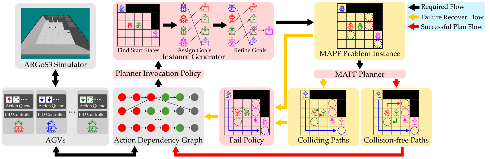

.. LSMART documentation master file.

.. raw:: html

   

     <video class="lsmart-hero-video" autoplay muted loop playsinline preload="auto">
       <source src="_static/front-video.mp4" type="video/mp4">
     </video>

     

       

         
         

           <a class="lsmart-btn lsmart-btn-primary" href="getting_started.html">Install</a>
           <a class="lsmart-btn" href="api.html">Documentation</a>
           <a class="lsmart-btn" href="https://github.com/lunjohnzhang/lifelong_mapf_argos">GitHub</a>
         

       

     

   

.. raw:: html

   

**Lifelong Scalable Multi-Agent Realistic Testbed (LSMART)**
======

**Paper and Citation**
==================
.. code-block:: bibtex

    @article{YanAndZhang2026LSMART,
        author    = {Jingtian Yan, Yulun Zhang, Zhenting Liu, Han Zhang, He Jiang, Jingkai Chen, Stephen F. Smith and Jiaoyang Li},
        title     = {Lifelong Scalable Multi-Agent Realistic Testbed and A Comprehensive Study on Design Choices in Lifelong AGV Fleet Management Systems},
        journal   = {ArXiv},
        volume    = {},
        year      = {2026}
    }

.. raw:: html

   

